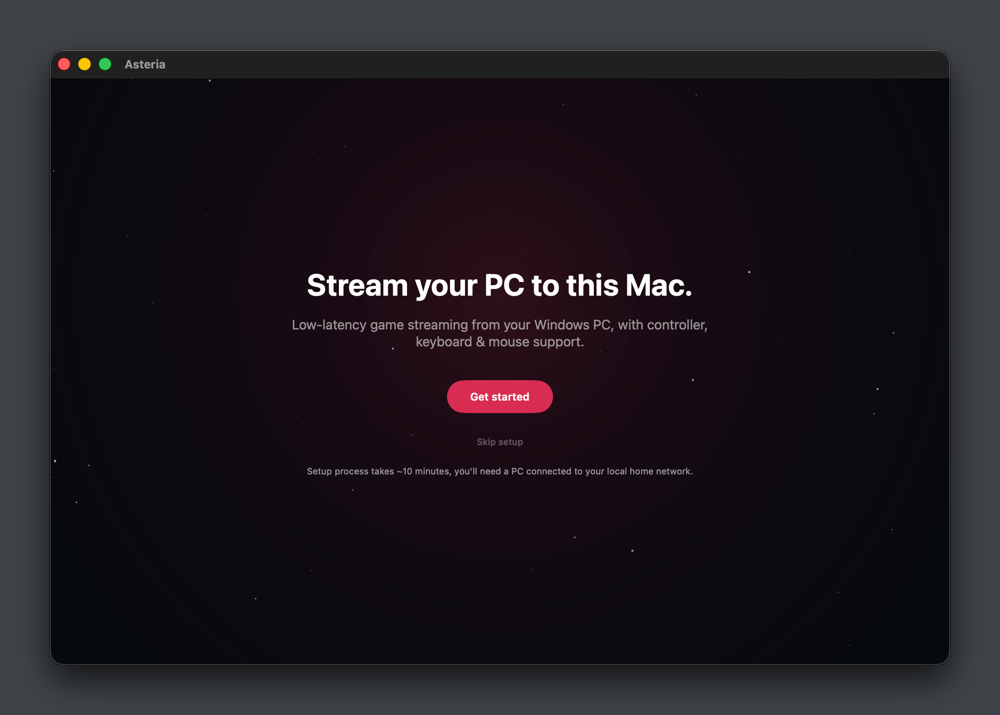
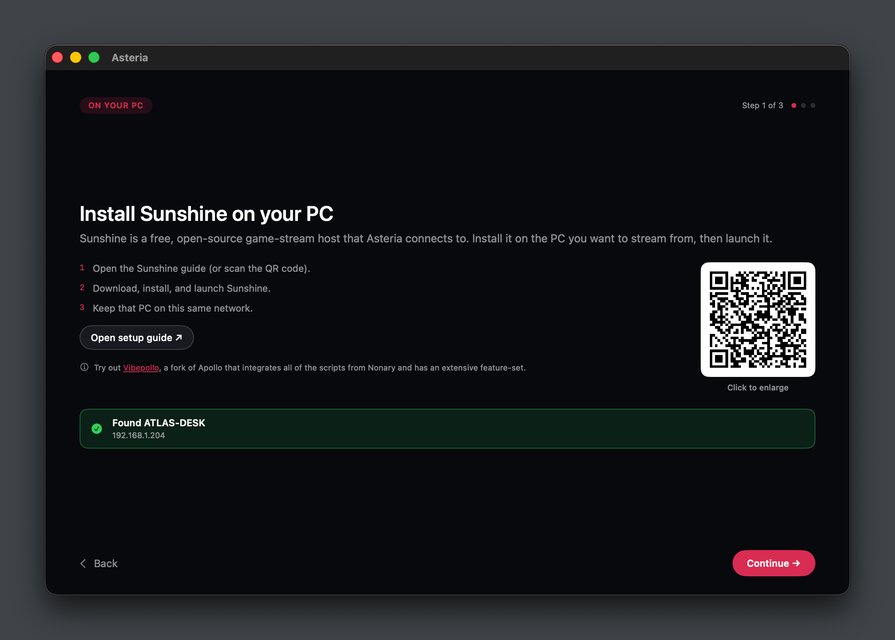
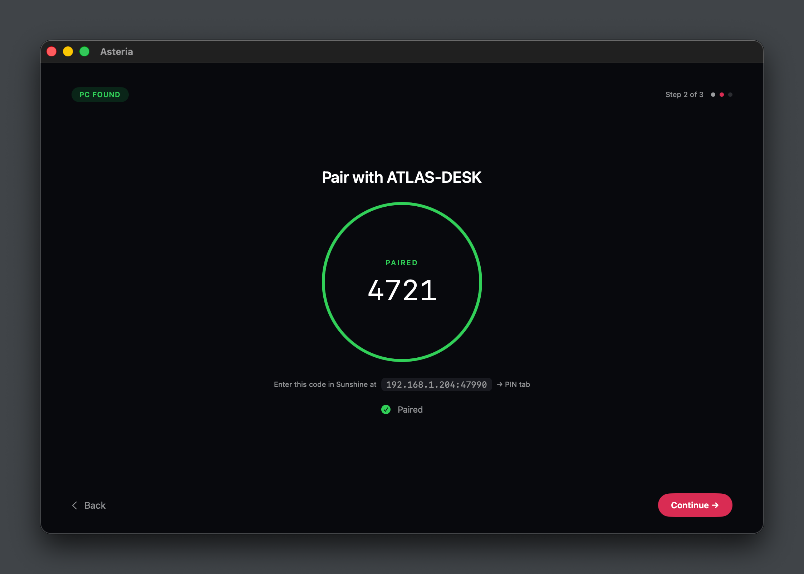
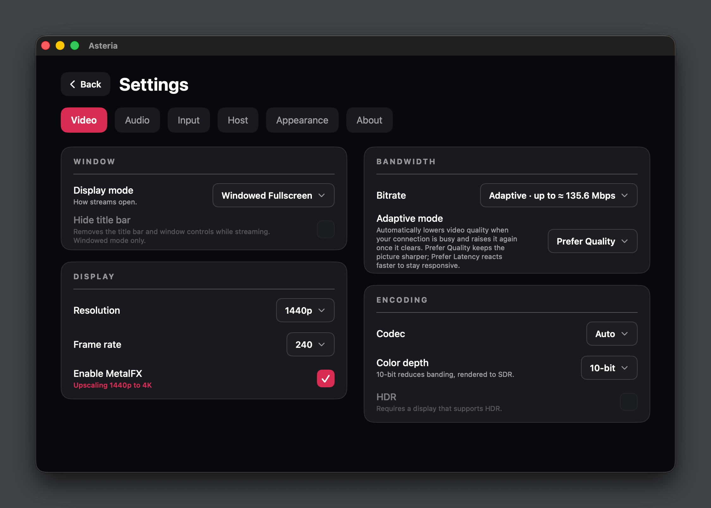
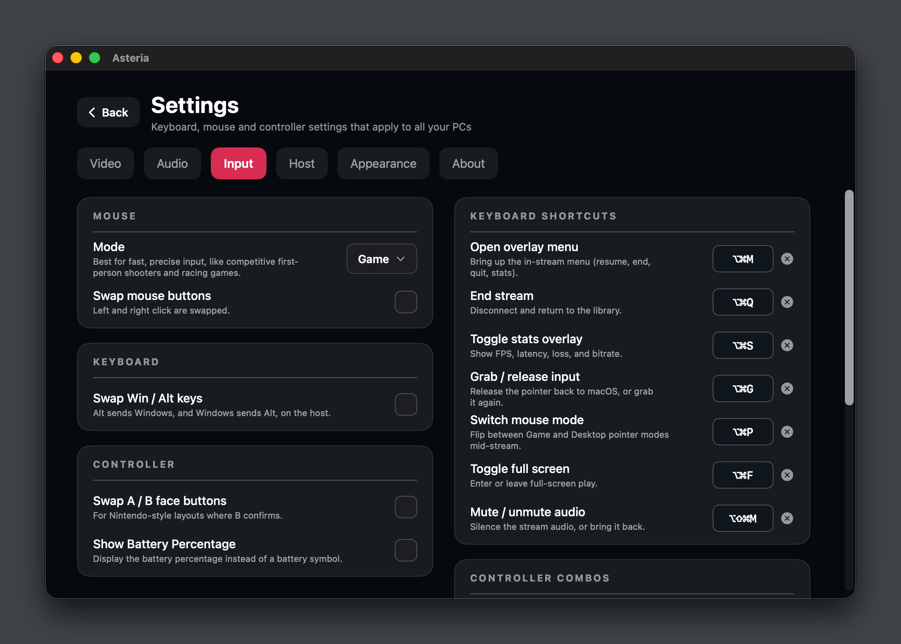
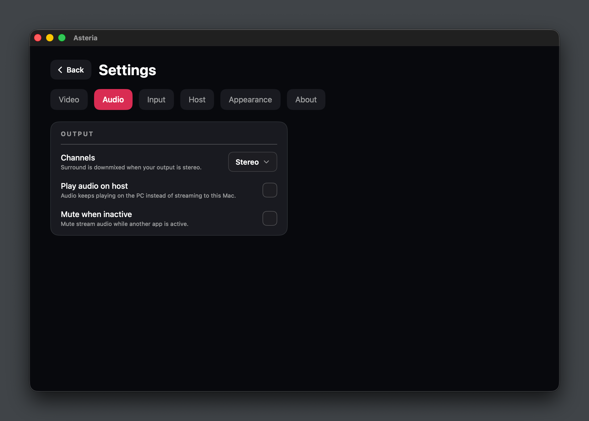
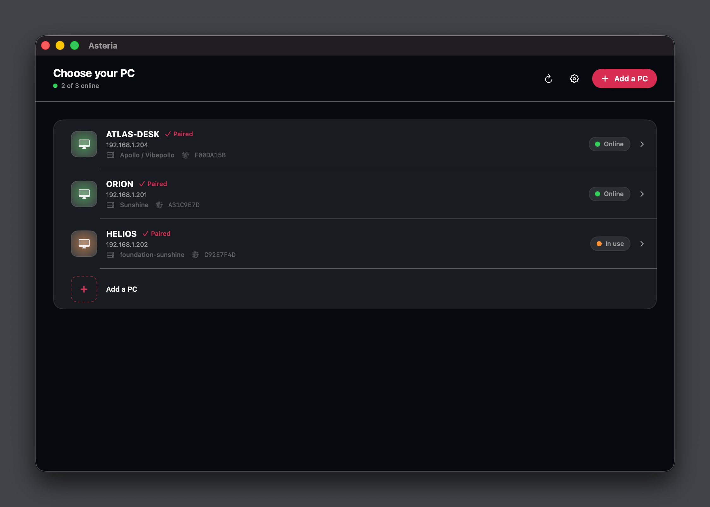
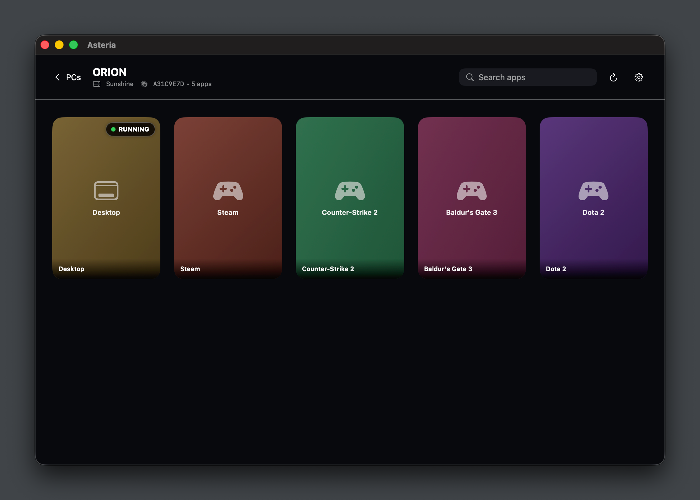

# Asteria

A low-latency, open-source GameStream client for macOS. Stream games from a
Windows PC running [Sunshine](https://app.lizardbyte.dev/Sunshine/)
to a Mac, with controller, keyboard, and mouse support.

> **No prebuilt binaries** - Asteria is build-from-source only.
> You'll need Xcode; see [Building](#building).

## Why does this exist when Moonlight does?
Moonlight is amazing at what it does; Asteria started because I wanted a Swift-native client that leans more on Apple's own frameworks and optimizations, plus the features I felt were
missing: adaptive bitrate, custom keybinds, MetalFX upscaling, and specific
UI-related quirks and thought it would be a cool challenge.

This project wouldn't exist without
[Moonlight](https://moonlight-stream.org) and their amazing work, so please
do support them and use Moonlight for a stable experience on Mac. I see
this project as just another option; it may be better for some, or Moonlight
may be better for them.

## Features

- **Low-latency streaming** - GameStream protocol with error recovery,
  and frames rendered through a latency-focused, Apple-native Metal pipeline.
- **Adaptive bitrate** - Stream quality reacts to network conditions in real
  time, with prefer-quality or prefer-latency behavior per connection.
  Requires [Vibepollo](https://github.com/Nonary/Vibepollo).
- **Hardware decoding** - H.264, HEVC (10-bit), and AV1.
- **HDR and MetalFX** - HDR/EDR output and MetalFX upscaling on supported
  displays.
- **Game Mode** - Supports macOS's Game Mode, so the system can optimize the
  Mac for gaming while you stream.
- **Input** - Keyboard and mouse support with two modes: Desktop and Game.
  Desktop optimizes the pointer for general use like browsing or remote
  desktop work, while Game uses Apple's Game Controller framework. Gamepads
  are supported, with rumble.
- **In-stream menu** - An overlay during streaming for quick actions like
  ending the stream, going fullscreen, muting audio, or switching pointer
  modes, without leaving your stream.
- **Rebindable hotkeys** - Set custom keybinds for actions across the app, such
  as ending the stream, toggling the stats overlay or fullscreen, switching
  pointer modes, and muting audio.
- **Per-PC settings** - Configurable stream settings for each host, layered on
  top of a global profile.
- **Auto-discovery** - Finds Sunshine/Apollo hosts on your local network via
  Bonjour, or add one manually by IP address or hostname.
- **Controller-navigable UI** - The entire app, including the in-stream menu,
  stats overlay, and settings deck, works equally well with a controller or a
  keyboard and mouse.
- **PIN pairing** - PIN-based mutual-TLS pairing. Your PC is paired to this
  Mac, no accounts required.

## Requirements

- macOS 26 (Tahoe) or later, Apple Silicon (`arm64`).
- A Windows PC on the same network running
  [Sunshine](https://app.lizardbyte.dev/Sunshine/) or one of its forks
  (e.g. [Apollo](https://github.com/ClassicOldSong/Apollo)).


## Screenshots

|                                     |                                                   |
|:---|:---|
|    |                |                                |
|  |  |
|     |     			   |

## Building

Build requirements:

- macOS 26 or later on an Apple Silicon Mac (`arm64`).
- [Xcode](https://developer.apple.com/xcode/). The script auto-detects Xcode
  in `/Applications`; override with `DEVELOPER_DIR`.
- [xcodegen](https://github.com/yonaskolb/XcodeGen). Install with
  `brew install xcodegen`.

```bash
# Generates the project, builds, and ad-hoc
# signs the app so it runs on the Mac.
./bootstrap.sh   # add --test for the full AsteriaKit suite, --release for optimized
./bootstrap.sh --project   # only generate the Xcode project, skip build/sign/test
./bootstrap.sh --doctor    # verify the environment (OS, chip, Xcode, Swift) and regenerate the project
```

Signing is ad-hoc ("Sign to Run Locally"), so no Apple Developer account is
required.

### First run

The ad-hoc signed app lands at
`.build/xcode/Build/Products/Debug/Asteria.app` (`--release` switches the
path to `Release`). Drag it to `/Applications` if you want to keep it, then:

1. Launch Asteria. Onboarding walks you through finding a host. Hosts on your
   local network are discovered automatically; you can also add one by IP or
   hostname.
2. Asteria shows a PIN. Open Sunshine (or Apollo) on your PC and enter that
   PIN when prompted to complete pairing.
3. Pick an app from the host's library and start streaming.

### Manual steps, if you prefer

```bash
# Generate the Xcode project from project.yml
xcodegen generate

# Headless core tests (TDD)
cd AsteriaKit
DEVELOPER_DIR=/Applications/Xcode.app/Contents/Developer \
CLANG_MODULE_CACHE_PATH=/private/tmp/asteria-clang-module-cache \
swift test --disable-sandbox

# App build (shared schemes in project.yml: Debug, Release)
DEVELOPER_DIR=/Applications/Xcode.app/Contents/Developer \
  xcodebuild -project Asteria.xcodeproj -scheme Debug -configuration Debug build
```

## Contributing

Contributions are welcome! See [`CONTRIBUTING.md`](CONTRIBUTING.md) for the
full guide. Contributions are accepted under the project's GPLv3 license
(see `LICENSE`).

- **TDD-first** - The `AsteriaKit` core is test-driven: red → green → refactor.
  Add tests for behavior changes; run the package suite before committing.
- **Conventional Commits** - `type(scope): short imperative subject` (e.g.
  `fix(pairing): …`); brief body only when context is needed.
- **Readable code** - Self-documenting code; comments only for non-obvious
  *why*.
- **No speculative features** - Build what the app needs; nothing more.
- **One feature per PR** - Keep pull requests focused on a single feature or
  fix so they stay easy to review and revert.
- **Regenerate the project** - After adding/removing/renaming files in the
  `Asteria/` app target, run `xcodegen generate` (see `AGENTS.md`).

## Acknowledgements

Asteria takes inspiration and ideas from various open-source game-streaming projects, It is not affiliated with, or endorsed by, any of these projects:

- [Sunshine](https://app.lizardbyte.dev/Sunshine/), the free, open-source game-stream
  host.
- [Apollo](https://github.com/ClassicOldSong/Apollo), fork of sunshine with
  virtual-display support.
- [Vibepollo](https://github.com/Nonary/Vibepollo), a community fork of
  Apollo with extra features
- [Moonlight](https://moonlight-stream.org), reference client for protocol
  behavior, features, and design.

## Third-party code

Asteria vendors a small set of permissively licensed libraries, fully
attributed in [`Asteria/Resources/ThirdPartyLicenses.md`](Asteria/Resources/ThirdPartyLicenses.md)
(also shown in the app under **Settings → Third-Party Licenses**):

- ENet (MIT) - reliable UDP networking for the stream connection
- nanors (MIT) - Reed-Solomon forward error correction
- libopus (BSD-3) - Opus audio decoding
- swift-crypto / swift-certificates / swift-asn1 / BoringSSL (Apache-2.0) -
  the cryptography behind PIN pairing

## AI disclosure

Asteria was built with the help of AI assistance, used only for development,
research, and documentation purposes. Nothing reaches the project without being human reviewed. AI has
really accelerated development speed, which lets me focus on the
features I want to add.

> [!WARNING]
> If you are not comfortable with the use of AI in software, then this project may not be for you.

## License

Asteria is free and open-source software, licensed under the
[GNU General Public License v3](LICENSE) (GPLv3).
